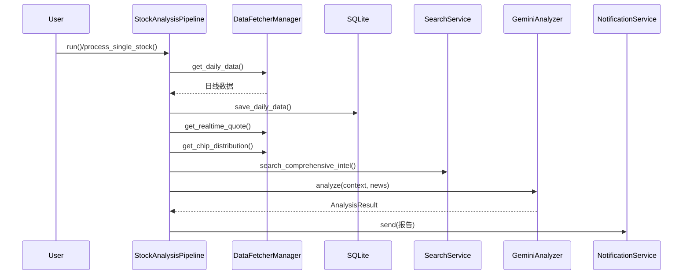
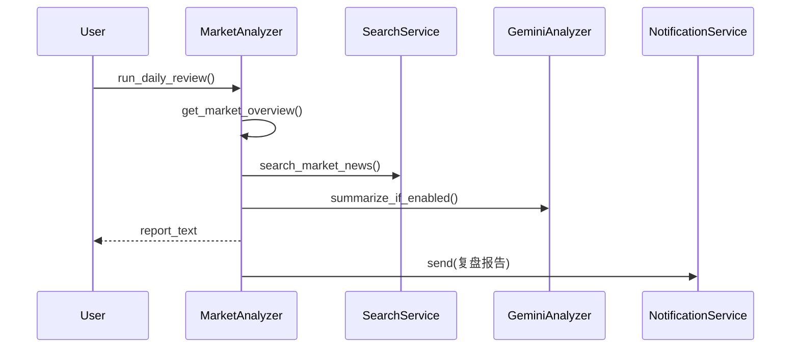
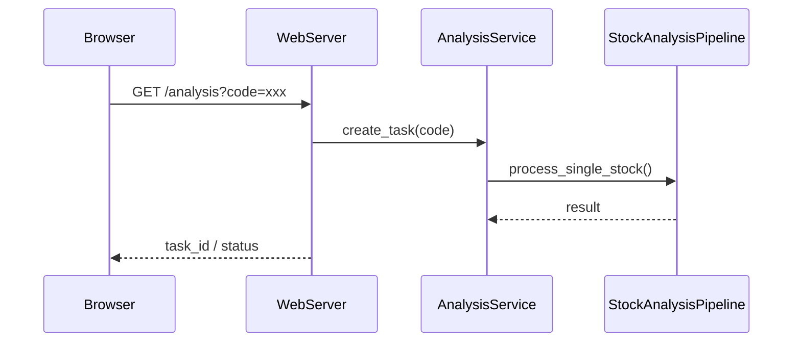
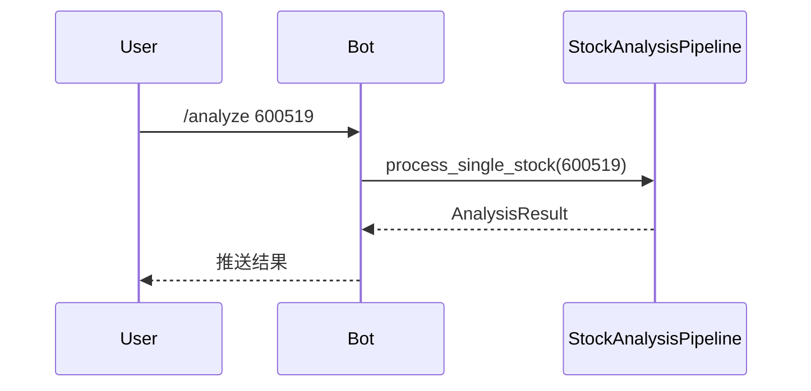

# 股票智能分析系统 - 系统设计文档

> 本文档基于当前代码实现重建，覆盖系统的**概要设计**与**详细设计**。
> 版本日期：2026-01-31

---

## 1. 概要设计

### 1.1 目标与范围

系统面向 A 股 / 港股 / 美股的自选股分析需求，提供：
- 多数据源行情获取与自动故障切换
- 实时行情与筹码分布增强
- 多维度新闻/舆情检索
- 大模型生成「决策仪表盘」报告
- 多渠道通知推送
- 机器人命令交互与 WebUI 操作入口

**当前实现范围内：**
- 日线数据持久化（SQLite）
- AI 分析结果**不持久化**
- 大盘复盘已实现，**北向资金获取暂未启用**

### 1.2 系统架构（分层）

```
应用层
  - main.py / analyzer_service.py / webui.py / bot/
核心业务层
  - StockAnalysisPipeline / MarketAnalyzer / SearchService / GeminiAnalyzer
数据访问层
  - DataFetcherManager + 各 Fetcher / SQLite (storage)
外部服务
  - Gemini / OpenAI兼容 / Tavily / SerpAPI / Bocha / 通知渠道
```

### 1.3 核心模块清单

| 模块 | 入口/路径 | 职责 |
|------|-----------|------|
| 配置管理 | `src/config.py` | 读取 .env / 环境变量，单例配置 |
| 分析流水线 | `src/core/pipeline.py` | 业务编排、并发调度、结果汇总 |
| AI 分析 | `src/analyzer.py` | Prompt 构造、API 调用、解析结果 |
| 趋势分析 | `src/stock_analyzer.py` | MA/乖离率/趋势评分 |
| 大盘复盘 | `src/market_analyzer.py`, `src/core/market_review.py` | 指数/市场概览/复盘生成 |
| 搜索服务 | `src/search_service.py` | Bocha/Tavily/SerpAPI 聚合 |
| 通知服务 | `src/notification.py` | 多渠道推送与分片 |
| 数据存储 | `src/storage.py` | SQLite ORM、断点续传 |
| 数据源管理 | `data_provider/` | 多源获取、熔断/缓存 |
| WebUI | `web/` | 配置页/触发分析/任务查看 |
| 机器人 | `bot/` | /analyze /batch /market |

### 1.4 数据流概览

```
配置加载 -> 刷新自选股 -> 预取实时行情(可选)
  -> 并发处理单股:
     - 获取并保存日线数据
     - 获取实时行情与筹码分布
     - 趋势分析
     - 情报搜索
     - AI 决策仪表盘生成
     - 可选单股推送
  -> 汇总报告 -> 推送
  -> 可选大盘复盘
```

### 1.5 数据持久化

- **仅持久化日线数据（stock_daily）**
- AI 分析结果**当前不落库**

### 1.6 部署方式

- **GitHub Actions**：工作日 18:00（北京时间）自动运行
- **Docker**：容器化部署
- **本地运行**：`python main.py`
- **WebUI**：`python webui.py`

---

## 2. 详细设计

### 2.1 配置管理（Config）

- 文件：`src/config.py`
- 特性：
  - 单例模式加载
  - .env + 系统环境变量
  - 支持代理配置与 NO_PROXY 自动补全
  - 运行时刷新自选股列表

关键配置项：
- `STOCK_LIST`
- AI：`GEMINI_*`, `OPENAI_*`
- 搜索：`BOCHA_API_KEYS`, `TAVILY_API_KEYS`, `SERPAPI_API_KEYS`
- 通知：`WECHAT_*`, `FEISHU_*`, `TELEGRAM_*`, `EMAIL_*`, `PUSHOVER_*`, `PUSHPLUS_TOKEN`, `DISCORD_*`, `CUSTOM_WEBHOOK_*`
- 系统：`MAX_WORKERS`, `LOG_LEVEL`, `SCHEDULE_*`, `MARKET_REVIEW_ENABLED`
- 实时行情：`ENABLE_REALTIME_QUOTE`, `ENABLE_CHIP_DISTRIBUTION`, `REALTIME_SOURCE_PRIORITY`
- WebUI / Bot：`WEBUI_*`, `BOT_*`, `FEISHU_*`, `DINGTALK_*`, `WECOM_*`

### 2.2 数据获取与多源策略（DataFetcherManager）

- 文件：`data_provider/base.py`
- 策略：按优先级尝试，多源故障切换
- 默认优先级：
  1. Efinance
  2. AkShare
  3. Pytdx
  4. Tushare（若配置 Token，可提升到最高）
  5. Baostock
  6. Yfinance（兜底）

**实时行情优先级（可配置）：**
- 默认：`akshare_sina,tencent,efinance,akshare_em`

**熔断机制：**
- 实时行情与筹码分布均支持熔断与降级

**批量预取：**
- 当股票数 >= 5 且优先级中包含全量源时启用

### 2.3 数据存储（SQLite）

- 文件：`src/storage.py`
- ORM 表：`stock_daily`
- 支持断点续传：若今日数据已存在，跳过抓取

表结构：
```sql
stock_daily(
  id, code, date, open, high, low, close, volume, amount, pct_chg,
  ma5, ma10, ma20, volume_ratio, data_source, created_at, updated_at
)
```

> 分析结果（AI）当前不落库。

### 2.4 分析流水线（StockAnalysisPipeline）

- 文件：`src/core/pipeline.py`
- 核心流程：
  1. 读取股票列表
  2. 预取实时行情（可选）
  3. 线程池并发处理单股
  4. 汇总结果并推送

**单股处理流程：**
- `fetch_and_save_stock_data()`
  - 断点续传
  - 保存到 SQLite
- `analyze_stock()`
  - 实时行情 + 筹码分布
  - 趋势分析（StockTrendAnalyzer）
  - 情报搜索（SearchService）
  - AI 分析（GeminiAnalyzer）

**并发策略：**
- 默认 `max_workers=3`

**报告模式：**
- `simple` / `full`（由 `REPORT_TYPE` 控制）

### 2.5 AI 分析器（GeminiAnalyzer）

- 文件：`src/analyzer.py`
- 功能：
  - 构造「决策仪表盘」Prompt
  - 调用 Gemini API
  - 失败时自动切换 OpenAI 兼容 API
  - 解析 JSON 输出到 `AnalysisResult`

**输出结构（摘要）：**
- `sentiment_score`, `trend_prediction`, `operation_advice`, `confidence_level`
- `dashboard`（核心结论、数据透视、舆情情报、作战计划）
- `analysis_summary`, `key_points`, `risk_warning`, `buy_reason`

### 2.6 搜索服务（SearchService）

- 文件：`src/search_service.py`
- 支持多引擎：Bocha / Tavily / SerpAPI
- 自动聚合：生成结构化情报摘要

### 2.7 大盘复盘（MarketAnalyzer）

- 文件：`src/market_analyzer.py`
- 数据来源：AkShare（指数、板块、统计） + Yfinance 兜底
- 北向资金获取接口暂未启用
- 复盘输出通过 `MarketAnalyzer.run_daily_review()` 生成

### 2.8 通知服务（NotificationService）

- 文件：`src/notification.py`
- 支持渠道：
  - 企业微信、飞书、Telegram、邮件
  - Pushover、PushPlus、Discord
  - 自定义 Webhook（钉钉/Slack/Bark 等）
- 超长消息按字节限制自动分片

### 2.9 WebUI

- 文件：`web/`
- 入口：`webui.py`
- 主要接口：
  - `GET /` 配置页面
  - `GET /analysis?code=xxx` 触发单股分析
  - `GET /tasks` 任务列表
  - `GET /task?id=xxx` 查询任务状态
  - `POST /update` 更新配置

### 2.10 机器人（Bot）

- 路径：`bot/`
- 命令：
  - `/analyze <code> [full]`
  - `/batch [n]`
  - `/market`

---

### 2.11 模块依赖图（概览）

```mermaid
graph TD
  main[main.py] --> pipeline[StockAnalysisPipeline]
  analyzer_service[analyzer_service.py] --> pipeline
  webui[webui.py] --> web_server[web/]
  bot[bot/] --> pipeline

  pipeline --> fetcher_mgr[DataFetcherManager]
  pipeline --> storage[DatabaseManager]
  pipeline --> analyzer[GeminiAnalyzer]
  pipeline --> search[SearchService]
  pipeline --> notifier[NotificationService]
  pipeline --> trend[StockTrendAnalyzer]

  fetcher_mgr --> efinance[EfinanceFetcher]
  fetcher_mgr --> akshare[AkshareFetcher]
  fetcher_mgr --> tushare[TushareFetcher]
  fetcher_mgr --> pytdx[PytdxFetcher]
  fetcher_mgr --> baostock[BaostockFetcher]
  fetcher_mgr --> yfinance[YfinanceFetcher]

  analyzer --> gemini[Gemini API]
  analyzer --> openai[OpenAI Compatible API]

  search --> bocha[Bocha]
  search --> tavily[Tavily]
  search --> serpapi[SerpAPI]

  notifier --> wechat[WeChat Webhook]
  notifier --> feishu[Feishu Webhook/Doc]
  notifier --> telegram[Telegram Bot]
  notifier --> email[SMTP Email]
  notifier --> pushover[Pushover]
  notifier --> pushplus[PushPlus]
  notifier --> discord[Discord]
  notifier --> custom[Custom Webhook]
```



---

### 2.12 接口与协议说明

#### 2.12.1 WebUI API

| 方法 | 路径 | 参数 | 说明 |
|------|------|------|------|
| GET | `/` | - | 配置页面 |
| GET | `/health` | - | 健康检查 |
| GET | `/analysis` | `code` | 触发单股分析（异步任务） |
| GET | `/tasks` | - | 任务列表 |
| GET | `/task` | `id` | 查询任务状态 |
| POST | `/update` | body | 更新配置 |

#### 2.12.2 Bot 命令

| 命令 | 参数 | 说明 |
|------|------|------|
| `/analyze` | `<code> [full]` | 分析单只股票，`full` 输出完整报告 |
| `/batch` | `[n]` | 批量分析自选股，`n` 为数量 |
| `/market` | - | 大盘复盘 |

#### 2.12.3 通知渠道载荷（约定）

- **企业微信/飞书**：默认 `markdown` 文本\n
- **Telegram**：纯文本或 Markdown\n
- **邮件**：HTML/纯文本\n
- **Discord**：Webhook 或 Bot\n
- **自定义 Webhook**：统一 JSON 格式（系统会自动适配常见平台）\n

---

### 2.13 数据模型说明（字段级）

#### 2.13.1 stock_daily（SQLite）

| 字段 | 类型 | 说明 |
|------|------|------|
| id | INTEGER | 主键 |
| code | VARCHAR(10) | 股票代码 |
| date | DATE | 交易日期 |
| open/high/low/close | FLOAT | OHLC |
| volume/amount | FLOAT | 成交量/成交额 |
| pct_chg | FLOAT | 涨跌幅 |
| ma5/ma10/ma20 | FLOAT | 均线 |
| volume_ratio | FLOAT | 量比 |
| data_source | VARCHAR(50) | 数据来源 |
| created_at/updated_at | DATETIME | 时间戳 |

#### 2.13.2 实时行情对象（UnifiedRealtimeQuote）

| 字段 | 说明 |
|------|------|
| name | 股票名称 |
| price | 当前价 |
| change / change_pct | 涨跌额 / 涨跌幅 |
| volume_ratio | 量比（部分数据源可能缺失） |
| turnover_rate | 换手率（部分数据源可能缺失） |
| source | 数据源标识 |

#### 2.13.3 筹码分布对象（ChipDistribution）

| 字段 | 说明 |
|------|------|
| profit_ratio | 获利比例 |
| avg_cost | 平均成本 |
| concentration_90 | 90%集中度 |
| source | 数据来源 |

---

### 2.14 JSON Schema（决策仪表盘）

```json
{
  "type": "object",
  "required": [
    "sentiment_score",
    "trend_prediction",
    "operation_advice",
    "confidence_level",
    "dashboard"
  ],
  "properties": {
    "sentiment_score": { "type": "integer", "minimum": 0, "maximum": 100 },
    "trend_prediction": { "type": "string" },
    "operation_advice": { "type": "string" },
    "confidence_level": { "type": "string", "enum": ["高", "中", "低"] },
    "dashboard": {
      "type": "object",
      "required": ["core_conclusion", "data_perspective", "intelligence", "battle_plan"],
      "properties": {
        "core_conclusion": {
          "type": "object",
          "required": ["one_sentence", "signal_type", "time_sensitivity", "position_advice"],
          "properties": {
            "one_sentence": { "type": "string" },
            "signal_type": { "type": "string" },
            "time_sensitivity": { "type": "string" },
            "position_advice": {
              "type": "object",
              "required": ["no_position", "has_position"],
              "properties": {
                "no_position": { "type": "string" },
                "has_position": { "type": "string" }
              }
            }
          }
        },
        "data_perspective": {
          "type": "object",
          "required": ["trend_status", "price_position", "volume_analysis", "chip_structure"],
          "properties": {
            "trend_status": {
              "type": "object",
              "required": ["ma_alignment", "is_bullish", "trend_score"],
              "properties": {
                "ma_alignment": { "type": "string" },
                "is_bullish": { "type": "boolean" },
                "trend_score": { "type": "integer", "minimum": 0, "maximum": 100 }
              }
            },
            "price_position": {
              "type": "object",
              "required": ["current_price", "ma5", "ma10", "ma20", "bias_ma5", "bias_status", "support_level", "resistance_level"],
              "properties": {
                "current_price": { "type": "number" },
                "ma5": { "type": "number" },
                "ma10": { "type": "number" },
                "ma20": { "type": "number" },
                "bias_ma5": { "type": "number" },
                "bias_status": { "type": "string" },
                "support_level": { "type": "number" },
                "resistance_level": { "type": "number" }
              }
            },
            "volume_analysis": {
              "type": "object",
              "required": ["volume_ratio", "volume_status", "turnover_rate", "volume_meaning"],
              "properties": {
                "volume_ratio": { "type": "number" },
                "volume_status": { "type": "string" },
                "turnover_rate": { "type": "number" },
                "volume_meaning": { "type": "string" }
              }
            },
            "chip_structure": {
              "type": "object",
              "required": ["profit_ratio", "avg_cost", "concentration", "chip_health"],
              "properties": {
                "profit_ratio": { "type": "number" },
                "avg_cost": { "type": "number" },
                "concentration": { "type": "number" },
                "chip_health": { "type": "string" }
              }
            }
          }
        },
        "intelligence": {
          "type": "object",
          "required": ["latest_news", "risk_alerts", "positive_catalysts", "earnings_outlook", "sentiment_summary"],
          "properties": {
            "latest_news": { "type": "string" },
            "risk_alerts": { "type": "array", "items": { "type": "string" } },
            "positive_catalysts": { "type": "array", "items": { "type": "string" } },
            "earnings_outlook": { "type": "string" },
            "sentiment_summary": { "type": "string" }
          }
        },
        "battle_plan": {
          "type": "object",
          "required": ["sniper_points", "action_checklist"],
          "properties": {
            "sniper_points": {
              "type": "object",
              "required": ["best_buy_point", "second_buy_point", "stop_loss", "take_profit"],
              "properties": {
                "best_buy_point": { "type": "number" },
                "second_buy_point": { "type": "number" },
                "stop_loss": { "type": "number" },
                "take_profit": { "type": "number" }
              }
            },
            "action_checklist": { "type": "array", "items": { "type": "string" } }
          }
        }
      }
    },
    "analysis_summary": { "type": "string" },
    "key_points": { "type": "string" },
    "risk_warning": { "type": "string" },
    "buy_reason": { "type": "string" }
  }
}
```

---

### 2.15 时序图（关键流程）

#### 2.15.1 单股分析流水线



#### 2.15.2 大盘复盘



#### 2.15.3 WebUI 触发分析



#### 2.15.4 Bot 命令



---

### 2.16 接口请求/响应示例

#### 2.16.1 WebUI - 触发单股分析

请求：
```
GET /analysis?code=600519
```

响应（示例）：
```json
{
  "task_id": "task_1735901",
  "status": "queued",
  "code": "600519"
}
```

查询任务状态：
```
GET /task?id=task_1735901
```

响应（示例）：
```json
{
  "task_id": "task_1735901",
  "status": "done",
  "result": {
    "code": "600519",
    "name": "贵州茅台",
    "sentiment_score": 72,
    "trend_prediction": "看多",
    "operation_advice": "持有"
  }
}
```

#### 2.16.2 Bot - 分析单股

输入：
```
/analyze 600519 full
```

输出（示例摘要）：
```
✅ 贵州茅台：趋势向上，量能温和放大，建议持有并等待回踩 MA5 加仓
```

---

### 2.17 代码级引用（实现定位）

| 主题 | 类/函数 | 文件路径 |
|------|---------|---------|
| 配置单例 | `Config.get_instance()` | `src/config.py` |
| 断点续传 | `fetch_and_save_stock_data()` | `src/core/pipeline.py` |
| 并发调度 | `StockAnalysisPipeline.run()` | `src/core/pipeline.py` |
| AI 调用 | `GeminiAnalyzer.analyze()` | `src/analyzer.py` |
| 数据源切换 | `DataFetcherManager.get_daily_data()` | `data_provider/base.py` |
| 实时行情 | `DataFetcherManager.get_realtime_quote()` | `data_provider/base.py` |
| 筹码分布 | `DataFetcherManager.get_chip_distribution()` | `data_provider/base.py` |
| 搜索聚合 | `SearchService.search_comprehensive_intel()` | `src/search_service.py` |
| 大盘复盘 | `MarketAnalyzer.run_daily_review()` | `src/market_analyzer.py` |
| 报告推送 | `NotificationService.send()` | `src/notification.py` |
| WebUI 路由 | `web/router.py` | `web/router.py` |
| WebUI 服务 | `AnalysisService` | `web/services.py` |
| Bot 命令 | `bot/commands/*.py` | `bot/commands/` |

---

## 3. 部署与运行

### 3.1 GitHub Actions

- 工作日 18:00（北京时间）定时运行
- 支持手动触发：`full / market-only / stocks-only`

### 3.2 本地运行

```
python main.py
```

### 3.3 WebUI

```
python webui.py
```

### 3.4 Docker

- 参见 `docs/DEPLOY.md`

---

## 4. 风险与限制

- AI 分析结果不持久化，重跑会覆盖输出
- 部分数据源可能不稳定，需依赖故障切换
- 实时行情与筹码接口可能因限流或封禁而降级
- 北向资金功能暂未启用

---

## 5. 未来可扩展方向（可选）

- 增加 `analysis_results` 表，持久化 AI 结果
- 任务队列 + 分布式调度
- 增加更多数据源与风险事件识别
- WebUI 增加历史查询与可视化

---

*文档结束*
